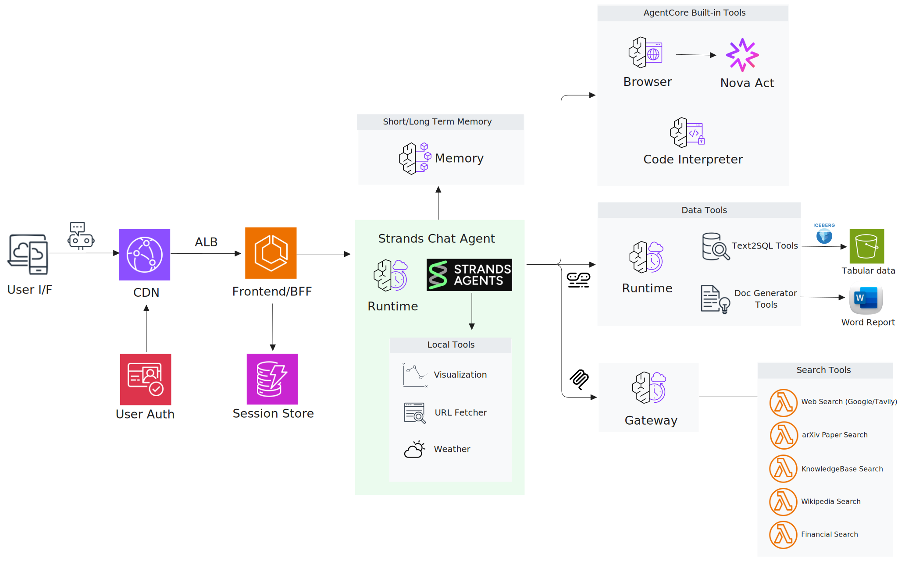
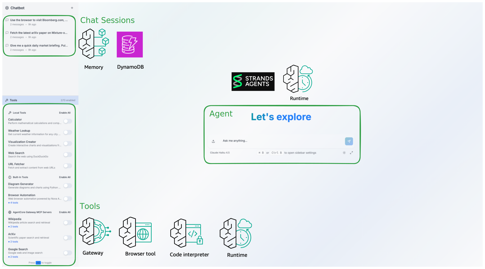
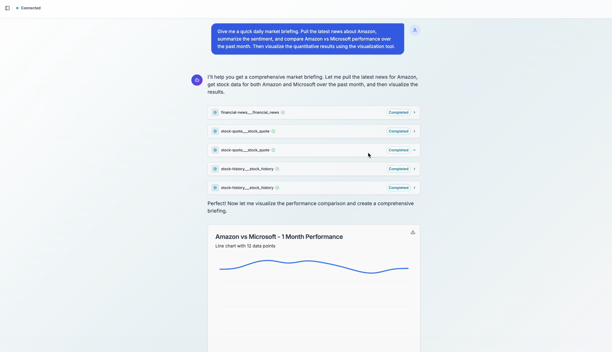
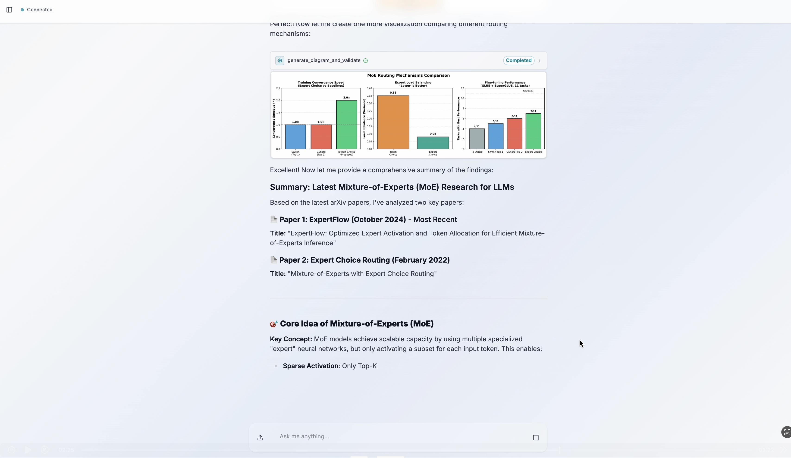
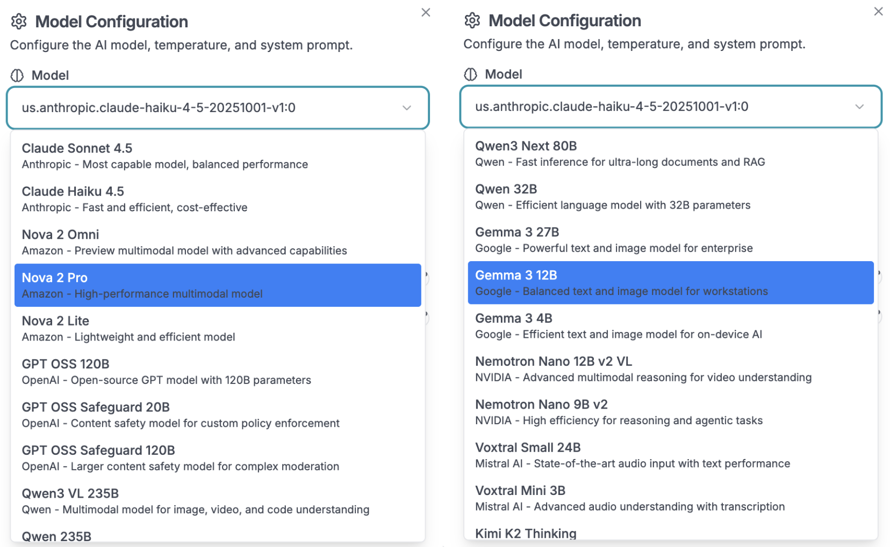
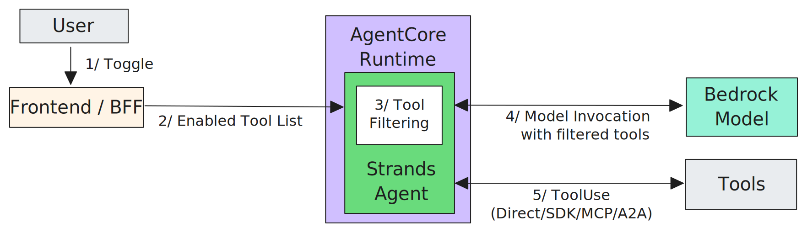
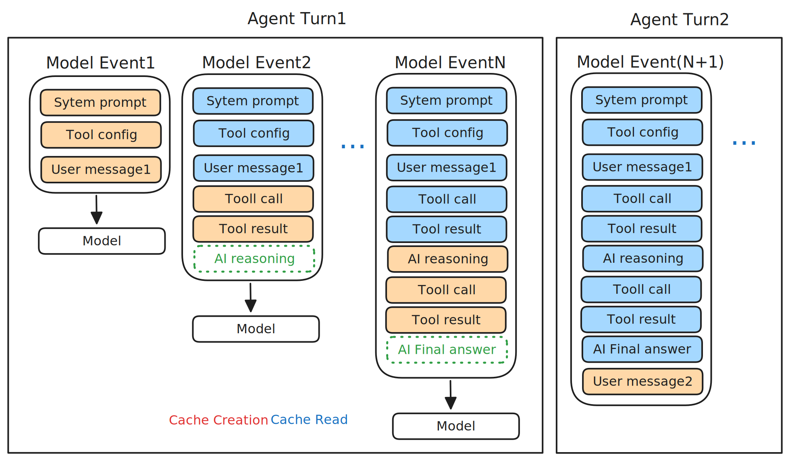

# Strands Agent Chatbot with AgentCore

Production-ready multi-agent conversational AI system built with Bedrock AgentCore and Strands Agents.
Supports RAG workflows, MCP-based tool integration, multimodal input/output, financial analysis tools,
and deep research orchestration with prompt caching and multi-protocol tool execution.

## Overview

Combines Strands Agent orchestration with AWS Bedrock AgentCore services:
- **Strands Agent**: Multi-turn conversation orchestration with tool execution
- **AgentCore Runtime**: Containerized agent deployment as managed AWS service
- **AgentCore Memory**: Persistent conversation storage with user preference retrieval
- **AgentCore Gateway**: MCP tool integration with SigV4 authentication
- **AgentCore Code Interpreter**: Built-in code execution for data analysis, visualization, and chart generation
- **AgentCore Browser**: Web automation via headless browser with live view streaming
- **Amazon Nova Act**: Agentic foundation model for browser automation with visual reasoning
- **A2A Protocol**: Agent-to-Agent communication enabling Chat Agent and Research Agent to collaborate seamlessly

**Quick Links:** [📸 UI Preview](#ui-preview) | [📹 Demo Videos](#demo-videos)

## Architecture



### Core Components

1. **Frontend + BFF** (Next.js)
   - Server-side API routes as Backend-for-Frontend
   - Cognito authentication with JWT validation
   - SSE streaming from AgentCore Runtime
   - Session management and file upload handling

2. **AgentCore Runtime**
   - Strands Agent with Bedrock Claude models
   - Turn-based session manager (optimized message buffering)
   - Uses AgentCore Memory for conversation persistence
   - Integrates with AgentCore Gateway via SigV4
   - Calls Built-in Tools via AWS API
   - Communicates with other agents via A2A protocol (Work in Progress)

3. **AgentCore Gateway**
   - MCP tool endpoints with SigV4 authentication
   - Routes requests to 5 Lambda functions (12 tools total)
   - Lambda functions use MCP protocol
   - Tools: Wikipedia, ArXiv, Google Search, Tavily, Finance

4. **AgentCore Memory**
   - Persistent conversation storage
   - Automatic history management across sessions

5. **Tool Ecosystem**
   - **Local Tools**: Weather, visualization, web search, URL fetcher (embedded in Runtime)
   - **Built-in Tools**: AgentCore Code Interpreter for diagrams/charts, AgentCore Browser for automation (AWS SDK + WebSocket)
   - **Gateway Tools**: Research, search, and finance data (via AgentCore Gateway + MCP)
   - **A2A Tools**: Research Agent for comprehensive web research with markdown reports (via A2A protocol)

## Key Features

- Amazon Bedrock AgentCore Runtime
- Strands Agent Orchestration
- MCP Gateway Tools (Wikipedia, ArXiv, Google, Tavily)
- A2A Agent-to-Agent Protocol
- Financial research tools (stock data, market news)
- Multimodal I/O (Vision, Charts, Documents, Screenshots)

## Use Cases
- Financial research agent with stock analysis & SEC ingestion
- Technical research assistant using multi-agent architecture
- Web automation agent via AgentCore Browser + Nova Act
- RAG-enabled chatbot using AgentCore Memory
- Multi-protocol research assistant (MCP, A2A, AWS SDK)

## UI Preview



*Interactive chatbot with dynamic tool filtering and multi-agent orchestration*

## Demo Videos

| Finance Assistant | Browser Automation | Academic Research | Deep Research (Multi Agent) |
|:---:|:---:|:---:|:---:|
| [](https://drive.google.com/file/d/1QQyaBWwzNOiLWe5LKZrSZoN68t7gsJdO/view?usp=sharing) | [](https://drive.google.com/file/d/1lPJGStD_YMWdF4a_k9ca_Kr-mah5yBnj/view?usp=sharing) | [](https://drive.google.com/file/d/1FliAGRSMFBh41m5xZe2mNpSmLtu_T1yN/view?usp=sharing) | [](https://drive.google.com/file/d/19lnw04LZDpK9D99bE-nqC37KTy3ML9zE/view?usp=sharing) |
| *Stock analysis, market news* | *Web automation with Nova Act* | *Research papers via ArXiv & Wikipedia* | *Supervisor-Worker pattern via A2A* |

## Key Technical Features

**1. Full-stack Web-based Chatbot Application**

- **Frontend**: Next.js with React, TypeScript, Tailwind CSS, shadcn/ui
- **Backend (BFF)**: Next.js API routes for SSE streaming, authentication, session management
- **Agent Runtime**: Strands Agent orchestration on AgentCore Runtime (containerized)
- **Persistence**: AgentCore Memory for conversation history and user context
- **Authentication**: AWS Cognito with JWT validation
- **Deployment**: CloudFront → ALB → Fargate (Frontend+BFF) + AgentCore Runtime

**2. Multi-Protocol Tool Architecture**

Tools communicate via different protocols based on their characteristics:

| Tool Type | Protocol | Count | Examples | Authentication |
|-----------|----------|-------|----------|----------------|
| **Local Tools** | Direct function calls | 5 | Weather, Web Search, Visualization | N/A |
| **Built-in Tools** | AWS SDK + WebSocket | 4 | AgentCore Code Interpreter, Browser (Nova Act) | IAM |
| **Gateway Tools** | MCP | 12 | Wikipedia, ArXiv, Finance (Lambda) | AWS SigV4 |
| **A2A Tools** | A2A protocol | 1 | Research Agent | AWS SigV4 |

Status: 22 tools ✅. See [Implementation Details](#multi-protocol-tool-architecture) for complete tool list.

**3. Multi-Model Selection**

Supports 20+ foundation models from multiple providers (Anthropic, Amazon, Google, Qwen, NVIDIA, Mistral).



**4. Dynamic Tool Filtering**

Users can enable/disable specific tools via UI sidebar, and the agent dynamically filters tool definitions before each invocation, sending only selected tools to the model to reduce prompt token count and optimize costs.

**5. Token Optimization via Prompt Caching**

Implements hooks-based caching strategy with system prompt caching and dynamic conversation history caching (last 2 messages), using rotating cache points (max 4 total) to significantly reduce input token costs across repeated API calls.

**6. Multimodal Input/Output**

Native support for visual and document content:
- **Input**: Images (PNG, JPEG, GIF, WebP), Documents (PDF, CSV, DOCX, etc.)
- **Output**: Charts from AgentCore Code Interpreter, screenshots from AgentCore Browser

**7. Two-tier Memory System**

Combines session-based conversation history (short-term) with namespaced user preferences and facts (long-term) stored in AgentCore Memory, enabling cross-session context retention with relevance-scored retrieval per user.

**8. Multi-agent Architecture**

The system implements a **Supervisor-Worker pattern** using A2A (Agent-to-Agent) protocol, enabling specialized agents to handle complex tasks independently while maintaining human oversight.

### Example: Research Agent Workflow


**Key Components:**

- **Supervisor Agent**: Main conversational interface that plans tasks, requests user approval, and delegates to specialized agents
- **Research Agent (A2A)**: Autonomous research specialist that executes approved plans using web search, Wikipedia, and generates markdown reports with charts
- **Human-in-the-Loop**: Strands Interrupt mechanism for user approval before delegating tasks
- **A2A Protocol**: AgentCore-managed communication enabling seamless cross-agent collaboration

**Benefits:**
- **Modularity**: Add specialized agents without modifying the supervisor
- **Human Control**: Approval workflow ensures oversight of autonomous operations
- **Scalability**: Each agent runs on independent AgentCore Runtime
- **Flexibility**: Agents can be updated, scaled, or replaced independently

## Implementation Details

### Multi-Protocol Tool Architecture

See [docs/TOOLS.md](docs/TOOLS.md) for detailed tool specifications.

| Tool Name | Protocol | API Key | Status | Description |
|-----------|----------|---------|--------|-------------|
| **Local Tools** | | | | |
| Calculator | Direct call | No | ✅ | Mathematical computations |
| Weather Lookup | Direct call | No | ✅ | Current weather by city |
| Visualization Creator | Direct call | No | ✅ | Interactive charts (Plotly) |
| Web Search | Direct call | No | ✅ | DuckDuckGo search |
| URL Fetcher | Direct call | No | ✅ | Web content extraction |
| **Built-in Tools** | | | | |
| Diagram Generator | AWS SDK | No | ✅ | Charts/diagrams via AgentCore Code Interpreter |
| Browser Automation (3 tools) | AWS SDK + WebSocket | Yes | ✅ | Navigate, action, extract via AgentCore Browser (Nova Act) |
| **Gateway Tools** | | | | |
| Wikipedia (2 tools) | MCP | No | ✅ | Article search and retrieval |
| ArXiv (2 tools) | MCP | No | ✅ | Scientific paper search |
| Google Search (2 tools) | MCP | Yes | ✅ | Web and image search |
| Tavily AI (2 tools) | MCP | Yes | ✅ | AI-powered search and extraction |
| Financial Market (4 tools) | MCP | No | ✅ | Stock quotes, history, news, analysis (Yahoo Finance) |
| **A2A Tools** | | | | |
| Research Agent | A2A protocol | No | ✅ | Comprehensive web research with markdown reports and citations |

**Protocol Details:**
- **Direct call**: Python function with `@tool` decorator, executed in runtime container
- **AWS SDK**: Bedrock client API calls (AgentCore Code Interpreter, AgentCore Browser)
- **WebSocket**: Real-time bidirectional communication for browser automation
- **MCP**: Model Context Protocol (via AgentCore Gateway with SigV4 authentication)
- **A2A protocol**: Agent-to-Agent communication with AWS SigV4 authentication for runtime-to-runtime collaboration

**Total: 22 tools** (22 ✅)

### Dynamic Tool Filtering

**Implementation:** `agent.py:277-318`

```python
# User-selected tools from UI sidebar
enabled_tools = ["calculator", "gateway_wikipedia-search___wikipedia_search"]

# Filters applied before agent creation
agent = Agent(
    model=model,
    tools=get_filtered_tools(enabled_tools),  # Dynamic filtering
    session_manager=session_manager
)
```



**Flow:**
1. **User Toggle**: User selects tools via UI sidebar
2. **Enabled Tools**: Frontend sends enabled tool list to AgentCore Runtime
3. **Tool Filtering**: Strands Agent filters tools before model invocation
4. **Invoke**: Model receives only enabled tool definitions
5. **ToolCall**: Agent executes local or remote tools as needed

**Benefits:**
- Reduced token usage (only selected tool definitions sent to model)
- Per-user customization
- Real-time tool updates without redeployment

### Token Optimization: Prompt Caching

**Implementation:** `agent.py:67-142`

Two-level caching via Strands hooks:

1. **System Prompt Caching** (static)
   ```python
   system_content = [
       {"text": system_prompt},
       {"cachePoint": {"type": "default"}}  # Cache marker
   ]
   ```

2. **Conversation History Caching** (dynamic)
   - `ConversationCachingHook` adds cache points to last 2 messages
   - Removes cache points from previous messages
   - Executes on `BeforeModelCallEvent`

**Cache Strategy:**
- Max 4 cache points: system (1-2) + last 2 messages (2)
- Cache points rotate as conversation progresses
- Reduces input tokens for repeated content



**Visual Explanation:**
- 🟧 **Orange**: Cache creation (new content cached)
- 🟦 **Blue**: Cache read (reusing cached content)
- Event1 creates initial cache, Event2+ reuses and extends cached context

### Turn-based Session Manager

**Implementation:** `turn_based_session_manager.py:15-188`

Buffers messages within a turn to reduce AgentCore Memory API calls:

```
Without buffering:
User message     → API call 1
Assistant reply  → API call 2
Tool use         → API call 3
Tool result      → API call 4
Total: 4 API calls per turn

With buffering:
User → Assistant → Tool → Result  → Single merged API call
Total: 1 API call per turn (75% reduction)
```

**Key Methods:**
- `append_message()`: Buffers messages instead of immediate persistence
- `_should_flush_turn()`: Detects turn completion
- `flush()`: Writes merged message to AgentCore Memory

### Multimodal I/O

**Input Processing** (`agent.py:483-549`):
- Converts uploaded files to `ContentBlock` format
- Supports images (PNG, JPEG, GIF, WebP) and documents (PDF, CSV, DOCX, etc.)
- Files sent as raw bytes in message content array

**Output Rendering**:
- Tools return `ToolResult` with multimodal content
- Images from AgentCore Code Interpreter and Browser rendered inline
- Image bytes delivered as raw bytes (not base64)
- Files downloadable from frontend

**Example Tool Output:**
```python
return {
    "content": [
        {"text": "Chart generated successfully"},
        {"image": {"format": "png", "source": {"bytes": image_bytes}}}
    ],
    "status": "success"
}
```

### Two-tier Memory System

**Implementation:** `agent.py:223-235`

```python
AgentCoreMemoryConfig(
    memory_id=memory_id,
    session_id=session_id,
    actor_id=user_id,
    retrieval_config={
        # User preferences (coding style, language, etc.)
        f"/preferences/{user_id}": RetrievalConfig(top_k=5, relevance_score=0.7),

        # User-specific facts (learned information)
        f"/facts/{user_id}": RetrievalConfig(top_k=10, relevance_score=0.3),
    }
)
```

**Memory Tiers:**
- **Short-term**: Session conversation history (automatic via session manager)
- **Long-term**: Namespaced key-value storage with vector retrieval
- Cross-session persistence via `actor_id` (user identifier)

## Quick Start

### Prerequisites

- **AWS Account** with Bedrock access (Claude models)
- **AWS CLI** configured with credentials
- **Docker** installed and running
- **Node.js** 18+ and **Python** 3.13+
- **AgentCore** enabled in your AWS account region

### Local Development

Run the application locally with Docker Compose:

```bash
# 1. Clone repository
git clone https://github.com/aws-samples/sample-strands-agent-with-agentcore.git
cd sample-strands-agent-with-agentcore

# 2. Setup dependencies
cd chatbot-app
./setup.sh

# 3. Configure AWS credentials
cd ../agent-blueprint
cp .env.example .env
# Edit .env with your AWS credentials and region

# 4. Start all services
cd ../chatbot-app
./start.sh
```

**Services started:**
- Frontend + BFF: http://localhost:3000
- Agent Backend: http://localhost:8000
- Local file-based session storage

**What runs locally:**
- ✅ Frontend (Next.js)
- ✅ AgentCore Runtime (Strands Agent)
- ✅ Local Tools (5 tools)
- ✅ Built-in Tools (Code Interpreter, Browser via AWS API)
- ❌ AgentCore Gateway (requires cloud deployment)
- ❌ AgentCore Memory (uses local file storage instead)

### Cloud Deployment

Deploy the full-stack application to AWS:

```bash
# Navigate to deployment directory
cd agent-blueprint

# Full deployment (all components)
./deploy.sh
```

**Deployment Components:**

1. **Main Application Stack** (`chatbot-deployment/`)
   - Frontend + BFF (Next.js on Fargate)
   - AgentCore Runtime (Strands Agent)
   - AgentCore Memory (conversation persistence)
   - CloudFront, ALB, Cognito
   - Deploy: `cd chatbot-deployment/infrastructure && ./scripts/deploy.sh`

2. **AgentCore Gateway Stack** (`agentcore-gateway-stack/`)
   - MCP tool endpoints with SigV4 authentication
   - 5 Lambda functions (12 tools total)
   - Wikipedia, ArXiv, Google Search, Tavily, Finance
   - Deploy: `cd agentcore-gateway-stack && ./scripts/deploy.sh`

3. **Research Agent Runtime** (`agentcore-runtime-a2a-stack/research-agent/`)
   - A2A protocol-based agent collaboration
   - Comprehensive web research with markdown report generation
   - Deploy: `cd agentcore-runtime-a2a-stack/research-agent && ./deploy.sh`

## Deployment Architecture

```
User → CloudFront → ALB → Frontend+BFF (Fargate)
                              ↓ HTTP
                         AgentCore Runtime
                         (Strands Agent container)
                              ↓
            ┌─────────────────┼─────────────────┐
            │                 │                 │
            ↓ SigV4           ↓ A2A             ↓ AWS SDK
     AgentCore Gateway   Research Agent    Built-in Tools
     (MCP endpoints)     Runtime ✅        (Code Interpreter,
            ↓                               Browser + Nova Act)
     Lambda Functions (5x)
     └─ Wikipedia, ArXiv,
        Google, Tavily, Finance

     AgentCore Memory
     └─ Conversation history
        User preferences & facts
```

## Technology Stack

**Frontend & Backend:**
- **Frontend**: Next.js, React, TypeScript, Tailwind CSS, shadcn/ui
- **BFF**: Next.js API Routes (SSE streaming, authentication, session management)
- **Deployment**: AWS Fargate (containerized)

**AI & Agent:**
- **Orchestration**: Strands Agents (Python)
- **Models**: AWS Bedrock Claude (Haiku default, Sonnet available)
- **Runtime**: AgentCore Runtime (containerized Strands Agent)

**AgentCore Services:**
- **Memory**: Conversation history with user preferences/facts retrieval
- **Gateway**: MCP tool endpoints with SigV4 authentication
- **Code Interpreter**: Python code execution for diagrams/charts
- **Browser**: Web automation with Nova Act AI model

**Tools & Integration:**
- **Local Tools**: Direct Python function calls (5 tools)
- **Built-in Tools**: AWS SDK + WebSocket (4 tools)
- **Gateway Tools**: Lambda + MCP protocol (12 tools)
- **Runtime Tools**: A2A protocol (9 tools, in progress)

**Infrastructure:**
- **IaC**: AWS CDK (TypeScript)
- **Frontend CDN**: CloudFront
- **Load Balancer**: Application Load Balancer
- **Authentication**: AWS Cognito
- **Compute**: Fargate containers


## Iframe Embedding

Embed the chatbot in external applications:

```html
<iframe
  src="https://your-domain.com/embed"
  width="100%"
  height="600"
  frameborder="0">
</iframe>
```

## Project Structure

```
sample-strands-agent-chatbot/
├── chatbot-app/
│   ├── frontend/              # Next.js (Frontend + BFF)
│   │   └── src/
│   │       ├── app/api/       # API routes (BFF layer)
│   │       ├── components/    # React components
│   │       └── config/        # Tool configuration
│   └── agentcore/             # AgentCore Runtime
│       └── src/
│           ├── agent/         # ChatbotAgent + session management
│           ├── local_tools/   # Weather, visualization, etc.
│           ├── builtin_tools/ # Code Interpreter tools
│           └── routers/       # FastAPI routes
│
└── agent-blueprint/
    ├── chatbot-deployment/    # Main app stack (Frontend+Runtime)
    ├── agentcore-gateway-stack/   # Gateway + 5 Lambda functions
    ├── agentcore-runtime-stack/   # Runtime deployment (shared)
    └── agentcore-runtime-a2a-stack/   # Research Agent (A2A)
```

## Documentation

- [DEPLOYMENT.md](DEPLOYMENT.md): Detailed deployment instructions

## Support

- **Issues**: [GitHub Issues](https://github.com/aws-samples/sample-strands-agent-with-agentcore/issues)
- **Troubleshooting**: [docs/guides/TROUBLESHOOTING.md](docs/guides/TROUBLESHOOTING.md)

## License

MIT License - see LICENSE file for details.

